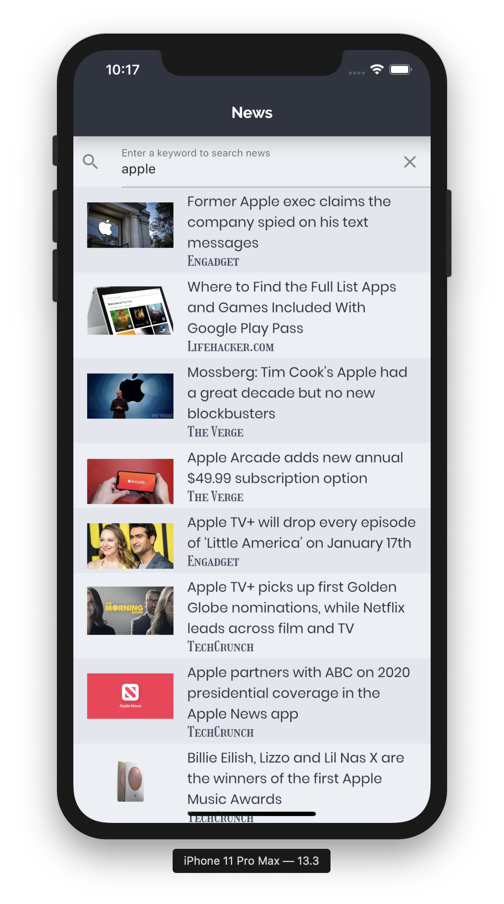

# fl_news

~~An example Flutter project using Bloc, Chopper and Webview.~~ v1

An example Flutter project using freezed, riverpod, Dio and Webview: v2 

To run this on your local, ~~please create **.env** file with your NEWS_API_KEY~~ (v1) for **[newapi.org](https://newsapi.org/)**.

Or altenatively (v2), you can use **assets/configuration.json** like the below with **configuration.provider.dart**.

`{`
    `"news_api_key": "<your api key>"`
`}`

## Getting Started

This project is a starting point for a Flutter application.

A few resources to get you started if this is your first Flutter project:

- [Lab: Write your first Flutter app](https://flutter.dev/docs/get-started/codelab)
- [Cookbook: Useful Flutter samples](https://flutter.dev/docs/cookbook)

For help getting started with Flutter, view our
[online documentation](https://flutter.dev/docs), which offers tutorials,
samples, guidance on mobile development, and a full API reference.